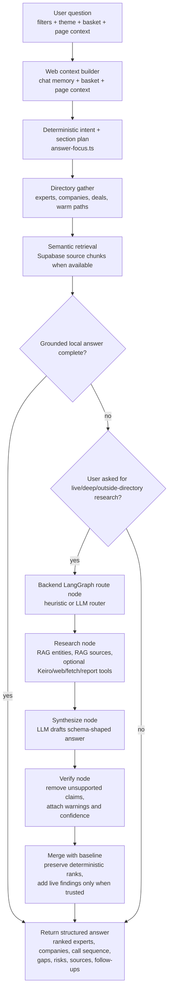

# TowerBrook People Expert Engine

Live Site: [https://towerbrook-arun.vercel.app](https://towerbrook-arun.vercel.app)

TowerBrook People Expert Engine is a graph-backed origination platform for thematic private equity sourcing. It turns a sector thesis into a practical calling plan: the most relevant experts, the companies they can unlock, the evidence behind each recommendation, and the warmest relationship paths into the market.


The demo focuses on three themes:

- Clean Energy Advisory & Development
- Grid Infrastructure & Connection
- Smart Water Infrastructure & Analytics

## What I Built

I built a Next.js application with a supporting FastAPI backend for live research, source extraction and Copilot enrichment. The product is designed for investment teams that need to move quickly from a thesis to the right market conversations.

The core workflow is:

```text
Theme -> expert shortlist -> basket -> Copilot -> sourced report
```

In practice, the app helps a team identify who to call, why they matter, which companies they may unlock, how TowerBrook might reach them, and what evidence supports the recommendation.

## Product Workflow

The application is organised like an analyst workbench rather than a static database:

1. Start in the command centre to pick a theme and review market coverage.
2. Open the expert call list and shortlist the people most likely to unlock the market.
3. Review each expert's source evidence, deal history, company links and warm-path signals.
4. Assign ownership, set status and capture notes so the investment team can coordinate coverage collaboratively.
5. Save experts and companies to the basket as a working deal-team shortlist.
6. Ask Copilot to turn the basket into a call plan, diligence sequence, target review or memo outline.
7. Move the answer into reports as a sourced output for a Monday meeting, call-prep pack or IC-style memo.

The main routes are:

- `/` command centre for theme selection, market coverage and workflow entry.
- `/experts` prioritised expert call list with ownership, status, notes, evidence, basket actions and exportable meeting packs.
- `/companies` target explorer showing companies surfaced through expert, transaction and source evidence.
- `/ask` Copilot workspace that returns ranked experts, ranked companies, call sequence, risks, gaps and cited sources.
- `/reports` memo workspace for sourced theme memos, company briefs and expert call plans.
- `/graph`, `/discover`, `/deals` and `/sources` for relationship mapping, discovery, transaction evidence and source review.

## Core Features

The key features are prioritised expert lists, company target discovery, basket-based workflow state, team ownership, expert status tracking, collaborative notes, structured Copilot answers, source-backed reports, deal intelligence, source registers and an interactive relationship graph.

Together, these create a repeatable path from "we like this theme" to "these are the people we should speak to this week, and this is why."

### Relationship Graph

The relationship graph is the core intelligence layer. Experts, companies, deals, source documents and TowerBrook contacts become nodes. Work history, board roles, advisory mandates, investments, transactions, shared employers, source citations and known TowerBrook relationships become edges.

This makes the app more than a search tool. It can explain why a person is relevant, which companies they may unlock, what evidence supports that view, and which introduction path is likely to be most credible.

The graph is designed for warm introductions. With fuller company data and verified internal contacts, the system would use LinkedIn profiles, work history, transaction history and board/advisor roles to identify overlapping time periods at the same company, fund, advisor, lender or board. Those overlaps would surface connected experts, second-degree routes and credible warm-intro paths into priority targets.

### Source Ingestion

Source ingestion is intended to compound the graph over time. A user should be able to add company documents, deal materials, PDFs, adviser lists or source URLs; LLM extraction then identifies named experts, companies, roles, dates, transactions and evidence.

Those extracted facts become reviewable candidates before they enrich the canonical relationship graph. The goal is for every new company document or deal source to make the expert network more complete, more explainable and more useful for origination.

### Expert Discovery Methodology

Experts were uncovered by working backwards from evidence rather than starting with a generic contact list. The discovery process looked for named operators, board members, advisers, investors and sector specialists who repeatedly appeared around priority companies, transactions, infrastructure projects and thematic market activity.

The primary source base was public and semi-structured business evidence: company websites, leadership biographies, annual reports, transaction announcements, investor presentations, fund and portfolio company statements, regulatory or procurement references, and adviser-authored market material. Where available, the research also used professional services signals such as accounting firm commentary, legal adviser announcements, restructuring or deal team references, and specialist consultant publications.

Each source was used to extract the same core facts: the person, their role, the organisation or transaction they were linked to, the date or context of that link, and the reason the connection mattered for the theme. Those facts were then converted into graph relationships so the product could show not only who the expert is, but why they are relevant, which companies they may unlock and what evidence supports the recommendation.

## Architecture

The web application is a Next.js product. The backend is a FastAPI service that supports Copilot orchestration, source extraction, discovery and graph enrichment.

The app can run locally from static JSON data without credentials. Optional API keys enable live search, extraction, Supabase persistence and enriched Copilot answers.

### Supabase Database

Supabase is the intended production database for durable graph and workflow state. It stores canonical experts, companies, sources, research jobs, discovery candidates, entity-match candidates and review status.

In the local demo, static JSON keeps the app easy to run. In a deployed version, Supabase is the layer that makes the product collaborative: ownership, status, notes, approved candidates and graph updates can be shared across an investment team rather than living in one browser session.

### Copilot Architecture

Copilot is deliberately directory-first. The web app gathers and ranks the curated data it already owns before asking the backend to synthesize anything. Most workflow prompts therefore return immediately from deterministic data: expert rankings, target companies, basket call plans, warm-intro routes, theme guidance and outreach drafts. Semantic retrieval can still add source chunks to that local evidence bundle. The backend LangGraph path is reserved for explicit live/deep research or cases where directory evidence is not enough.




This keeps the ranking authority with the curated TowerBrook directory and warm-path register, while still using the LLM where it is strongest: turning gathered evidence into concise, structured prose. The backend graph is observable as four nodes — route, research, synthesize and verify — and request traces record the timing and tool calls for each phase.

## Key Design Choices

I made experts the primary object rather than companies or deals. In thematic PE origination, the highest-leverage question is often not "what company should we look at?" but "who can credibly explain the market and lead us to the right companies?"

The data model is graph-shaped because origination is relationship-shaped. Experts, companies, deals, sources and TowerBrook relationship paths are connected through typed evidence-backed relationships. That lets the UI rank experts, explain warm paths, derive target companies from people rather than from a flat company list, and show why one introduction route is stronger than another.

Copilot responses are structured JSON, not free-form prose. The UI renders ranked experts, ranked companies, call sequence, risks, gaps, assumptions and sources deterministically, so the answer stays inspectable and reusable in reports.

Live discovery is review-gated. Search and extraction can create candidate people, companies and facts, but canonical graph data is not mutated until a human review step approves the candidate.

## Where I Used AI

AI is used in the product and in the development process.

In the product, DeepSeek-style models support extraction, synthesis, Copilot answer drafting, call-plan generation and memo drafting. KeiroLabs and optional search providers support live source discovery. AI output is treated as candidate evidence, not final truth: generated entities and facts keep source metadata, confidence and review status.

In development, I used AI assistance to speed up test iteration, data-pipeline design and bug fixing. The main implementation decisions, workflow design, data-review posture and final acceptance checks were kept human-directed.

## What I Would Do With More Time

I would add paid data sources such as PitchBook, Preqin, MergerMarket and LinkedIn Sales Navigator to improve coverage and identity resolution. I would also add a broader set of experts, source material, company documents and verified internal contact data to the application database so the relationship graph could find overlapping work-history periods, shared employers, shared deals, board overlaps and credible warm-intro paths into connected experts and target companies.

I would also build a first-class reviewer UI for approving and merging discovery candidates, add CRM/email/calendar overlays for real warm-path scoring, and close the loop by turning expert call notes into new expert, company and referral candidates.

The next product step would be production hardening: authentication, multi-user workspaces, persistent basket state, audit logs, scheduled discovery monitors and deeper end-to-end tests around the full expert-to-memo workflow.

## How To Run Locally

Install dependencies:

```bash
pnpm install
```

Run the web app:

```bash
pnpm dev
```

Open `http://localhost:3000`.

To run the Python API for live Copilot enrichment and discovery:

```bash
cd apps/backend-api
python3 -m venv .venv
. .venv/bin/activate
pip install -r requirements.txt
cd ../..
pnpm api:dev
```

Copy the example environment file if you want live integrations:

```bash
cp .env.example .env
```

Important optional variables include `BACKEND_API_URL`, `BACKEND_API_TOKEN`, `SUPABASE_URL`, `SUPABASE_SERVICE_ROLE_KEY`, `DEEPSEEK_API_KEY`, `KEIROLABS_API_KEY`, `GEMINI_API_KEY`, `TAVILY_API_KEY`, `SERPER_API_KEY` and `BRAVE_SEARCH_API_KEY`.

Useful checks:

```bash
pnpm lint
pnpm typecheck
pnpm build
pnpm ingest:validate
pnpm api:test
pnpm --dir apps/web test:unit
```

The full verification gate is:

```bash
pnpm verify
```

## Data And Generation Scripts

The repo includes static demo data in `apps/web/data`, including:

- `experts.json`
- `companies.json`
- `deals.json`
- `sources.json`
- `towerbrook-warm-paths.json`
- `source-register.json`
- `candidates.json`
- `graph-ready.json`
- generated census and origination candidate files

Regenerate or validate the main generated artifacts with:

```bash
pnpm investment:census
pnpm private-equity:census
pnpm expert:census
pnpm government-investment:census
pnpm origination:jobs
pnpm ingest:validate
```

The offline review pipeline can also be run directly:

```bash
node apps/web/scripts/data-pipeline.mjs run --offline
node apps/web/scripts/data-pipeline.mjs validate
```


